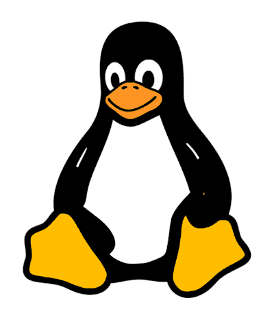
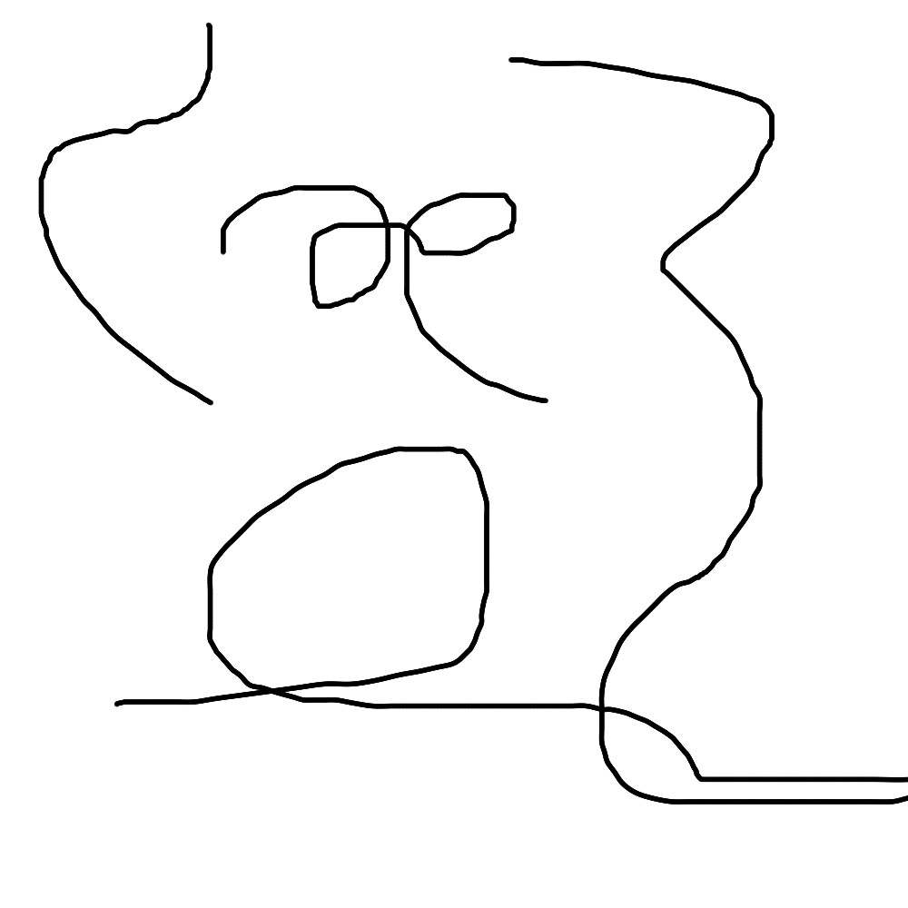
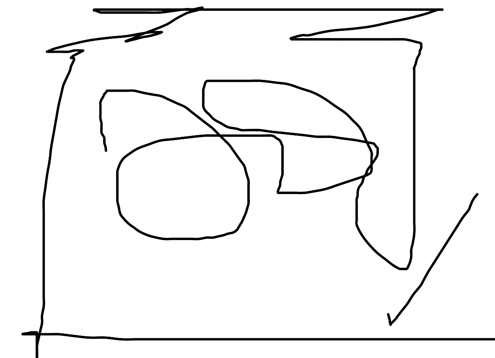

::: left-col

## PERSONALIEN

* ⌂ Suedhalbkugelweg 123
* ⚐ 4567 Offenes Meer
* ✆ +12 34 - 567 89 01
* ✉ [tux@markdown.de](tux@markdown.de)

## SPRACHEN

* **Tuxisch** *(Muttersprache)*  
  ■■■■■■■■■■
* **Ozeanisch**  
  ■■■■■■■□□□
* **Pingulinisch**  
  ■■■■■□□□□□
* **Piepsisch**  
  ■■□□□□□□□□

## AUSBILDUNG

* **Rettungsschwimmer EFZ**  
  *Berufsschule Ozeania*  
  2008 – 2010

* **Badmeister**  
  *Fachhochschule Suedhalbkugel*  
  2010 – 2015

## KOMPETENZEN

* ‣ loyal
* ‣ verantwortungsbewusst
* ‣ vorausschauend
* ‣ offen und verbindlich
* ‣ Teamplayer
* ‣ zielstrebig

## PRIVAT und FREIZEIT

### Familie

* *verheiratet mit Pinga*

* *gemeinsame Kinder*
  * Pingi (2020)
  * Pingo (2021)
  * Pingu (2023)

### Hobbies
* ‣ Schwimmen und Tauchen
* ‣ Fischen
* ‣ Linux & Opensource SW
* ‣ Eisbaden
* ‣ Elektronik, Mikrocontroller
* ‣ Wandern
* ‣ Lesen

:::

::: right-col

# Tux Pinguin

##### Fischer

---

## BERUFSERFAHRUNGEN

### Fischer

#### Open Sea GmbH | 2015 – heute |

* Unterwasser Sichtungen
* Tauchgänge
* Unterwasserkommunikation
* Schwarmerkennung

### Badmeister

#### Eisschollenbad AG | 2010 – 2015 |

* Oberste Aufsicht im Bad-Bereich
* Prüfung Wasserqualität
* Sporttauchgangleiter

### Rettungsschwimmer EFZ

#### Gefiederschulbad | 2008 – 2010 |

* Theorie
* Praxis
* Berufsschule

### FACHKOMPETENZEN

* Evaluationen von biologischem Fischfutter.
* Vertiefte Prozess-Kenntnisse einer Fischaufzucht.
* Programmierung von Fischzuchtsteuerungen.
* Erstellen von Maschinen- und Anlagen-Dokumentationen.
* Gewohnt im Umgang mit Fischen.
* Schulungen von Mitarbeiter.
* Ersatzteil-Managment.

### IT-SKILLS

* **Betriebssysteme**: Linux, BSD Unix, DOS
* **Hardware und Platformen**: x86, ARM64, RISC-V.
* **Dokumentation**: LaTeX, Markdown, HTML, CSS, groff, pandoc.
* **Programmiersprachen**: Python, Micropython, C, Tcl/Tk, Bash.
* **Office**: MS-Office, Libre Office, Abiword, Gnumeric.
* **ERP**: SAP, MS Navision
* **Grafik**: Gimp, Inkscape, Dia, Micrographics Designer, Corel Draw, Teklynx Codesoft, Photoshop.
* **CAD**: Freecad 3D, Xcircuit.
* **Simulation**: LT-Spice, Tina TI.
* **Audio**: Cubase, Audacity, Ardour.
* **Video**: Finalcut Pro.

### KURSE

* Fischaufzucht Basic I
* Fischaufzucht Advanced II
* Biologie für Fortgeschrittene
* Gefiederpflege ABC

### AUSWEISE

* Fähigkeitszeugnis als Rettungsschwimmer EFZ
* Diplom Berufsbildner (Swissmem Kaderschule)

:::

::: attachments

## ANHANG

:::
